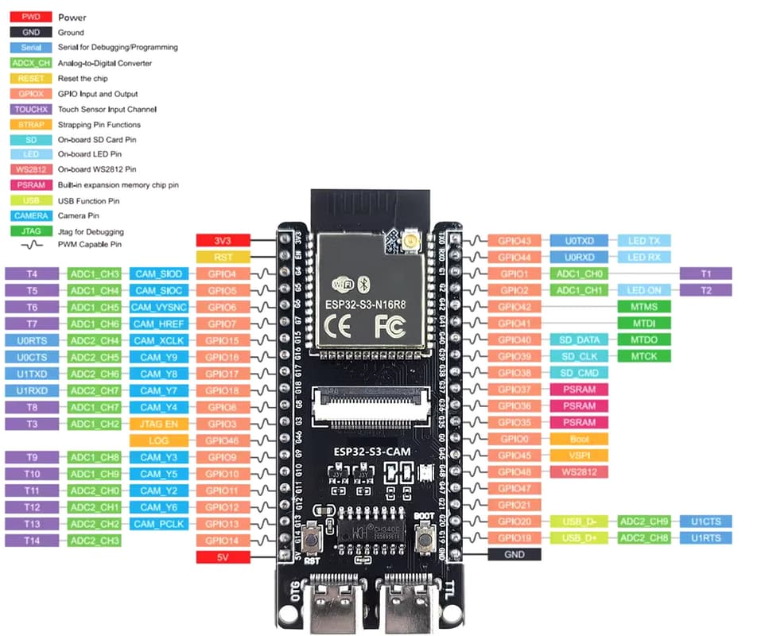

# Pinout - ESP32-S3-CAM

Documento de referencia de pines para la placa **ESP32-S3-CAM** utilizada en este repositorio.

> **Importante:** esta información parte de la documentación inicial recopilada para la placa y debe validarse progresivamente con pruebas reales. En una placa ESP32-S3-CAM no todos los GPIO están disponibles para uso general: la cámara, el RGB integrado, botones, USB, UART, SD, Flash y PSRAM pueden ocupar o condicionar determinados pines.

---

## 1. Resumen de la placa

- **Placa:** ESP32-S3-CAM
- **Módulo:** ESP32-S3-WROOM-1 N16R8
- **Flash:** 16 MB
- **PSRAM:** 8 MB
- **Cámara:** OV2640
- **LED RGB integrado:** NeoPixel / WS2812
- **GPIO LED RGB:** GPIO48
- **Framework inicial:** Arduino Framework con PlatformIO
- **Framework avanzado previsto:** ESP-IDF

---

## 2. Pinout visual de referencia

La siguiente imagen muestra el pinout visual de la placa GOOUUU ESP32-S3-CAM utilizada como referencia inicial.

>Nota:Esta imagen es una referencia visual. Algunos pines pueden tener funciones alternativas o restricciones según el uso de cámara, SD, PSRAM, USB, UART, JTAG o arranque. Antes de utilizar un GPIO en un ejercicio, se debe comprobar su disponibilidad en `gpio_reservados.md` y validarlo experimentalmente.




## 2. Regla principal de uso de GPIO

Antes de usar un GPIO en cualquier ejercicio, se debe comprobar:

1. Si está usado por la cámara.
2. Si está reservado por Flash o PSRAM.
3. Si está asociado a USB, UART, boot o SD.
4. Si está conectado a un periférico integrado.
5. Si está expuesto físicamente en la placa.
6. Si admite la función prevista: entrada, salida, ADC, I2C, SPI, PWM, interrupción, etc.

> Si un pin no está confirmado como libre, no debe usarse todavía en ejercicios generales.

---

## 3. Pines confirmados o relevantes

| GPIO | Uso conocido / función | Estado recomendado | Notas |
|---:|---|---|---|
| GPIO0 | BOOT / arranque | Evitar salvo necesidad | Puede afectar al modo de arranque. |
| GPIO1 | SDA / A0 según pinout | Usar con precaución | Puede emplearse para I2C si está libre. |
| GPIO2 | SCL / A1 según pinout | Usar con precaución | Puede emplearse para I2C si está libre. |
| GPIO3 | Switch integrado | Candidato para botón | Revisar comportamiento real en placa. |
| GPIO4 | CAM_SIOD / SDA cámara | Reservado cámara | No usar para ejercicios generales. |
| GPIO5 | CAM_SIOC / SCL cámara | Reservado cámara | No usar para ejercicios generales. |
| GPIO6 | CAM_VSYNC | Reservado cámara | No usar para ejercicios generales. |
| GPIO7 | CAM_HREF | Reservado cámara | No usar para ejercicios generales. |
| GPIO8 | CAM_Y4 / D2 | Reservado cámara | No usar para ejercicios generales. |
| GPIO9 | CAM_Y3 / D1 | Reservado cámara | No usar para ejercicios generales. |
| GPIO10 | CAM_Y5 / D3 | Reservado cámara | No usar para ejercicios generales. |
| GPIO11 | CAM_Y2 / D0 | Reservado cámara | No usar para ejercicios generales. |
| GPIO12 | CAM_Y6 / D4 | Reservado cámara | No usar para ejercicios generales. |
| GPIO13 | CAM_PCLK | Reservado cámara | No usar para ejercicios generales. |
| GPIO14 | A13 según pinout | Revisar | Posible GPIO disponible, validar antes. |
| GPIO15 | CAM_XCLK | Reservado cámara | No usar para ejercicios generales. |
| GPIO16 | CAM_Y9 / D7 | Reservado cámara | No usar para ejercicios generales. |
| GPIO17 | CAM_Y8 / D6 | Reservado cámara | No usar para ejercicios generales. |
| GPIO18 | CAM_Y7 / D5 | Reservado cámara | No usar para ejercicios generales. |
| GPIO19 | USB D+ | Evitar | Relacionado con USB. |
| GPIO20 | USB D- | Evitar | Relacionado con USB. |
| GPIO21 | BLK / Backlight según pinout | Usar con precaución | Puede estar asociado a periféricos externos o LCD. |
| GPIO22-GPIO25 | No existen / no disponibles | No usar | Según documentación de la placa. |
| GPIO26-GPIO32 | Flash / PSRAM | No usar | Reservados internamente. |
| GPIO33-GPIO34 | Missing / no expuestos | No usar | No disponibles en esta placa. |
| GPIO35-GPIO37 | PSRAM según pinout | No usar | Reservados o conflictivos. |
| GPIO38 | SD_CMD | Reservado SD | Evitar si se usa SD. |
| GPIO39 | SD_CLK | Reservado SD | Evitar si se usa SD. |
| GPIO40 | SD_DATA | Reservado SD | Evitar si se usa SD. |
| GPIO41 | MOSI / SPI LCD | Usar con precaución | Posible SPI, revisar periféricos conectados. |
| GPIO42 | SCLK / SPI LCD | Usar con precaución | Posible SPI, revisar periféricos conectados. |
| GPIO43 | U0TXD / TX | Evitar para GPIO general | Usado para UART/monitor serie. |
| GPIO44 | U0RXD / RX | Evitar para GPIO general | Usado para UART/monitor serie. |
| GPIO45 | DC / Shutter según pinout | Usar con mucha precaución | Puede estar asociado a funciones especiales/periféricos. |
| GPIO46 | Shutter | Candidato para botón | Validar si se comporta como botón integrado. |
| GPIO47 | CS / SPI LCD | Usar con precaución | Puede estar asociado a SPI/periféricos. |
| GPIO48 | RGB NeoPixel / WS2812 | Reservado RGB | Usado para LED RGB integrado. |

---

## 4. Pines usados por la cámara OV2640

La cámara ocupa varios GPIO. Estos pines deben considerarse **reservados** cuando se quiera usar la cámara o mantener compatibilidad futura con ella.

| Señal cámara | GPIO | Descripción |
|---|---:|---|
| CAM_SIOD | GPIO4 | Datos SCCB/I2C de cámara. |
| CAM_SIOC | GPIO5 | Reloj SCCB/I2C de cámara. |
| CAM_VSYNC | GPIO6 | Sincronismo vertical. |
| CAM_HREF | GPIO7 | Referencia horizontal. |
| CAM_Y4 | GPIO8 | Dato paralelo cámara. |
| CAM_Y3 | GPIO9 | Dato paralelo cámara. |
| CAM_Y5 | GPIO10 | Dato paralelo cámara. |
| CAM_Y2 | GPIO11 | Dato paralelo cámara. |
| CAM_Y6 | GPIO12 | Dato paralelo cámara. |
| CAM_PCLK | GPIO13 | Pixel clock. |
| CAM_XCLK | GPIO15 | Reloj externo de cámara. |
| CAM_Y9 | GPIO16 | Dato paralelo cámara. |
| CAM_Y8 | GPIO17 | Dato paralelo cámara. |
| CAM_Y7 | GPIO18 | Dato paralelo cámara. |

### Consecuencia práctica

No utilizaremos estos pines para ejercicios generales como:

- botón externo,
- LED externo,
- I2C externo,
- SPI externo,
- sensores analógicos,
- PWM,
- interrupciones.

Aunque alguno pudiera funcionar si la cámara no se inicializa, se evitará para mantener una arquitectura limpia y compatible con futuros ejercicios de cámara.

---

## 5. LED RGB integrado

| Elemento | Valor |
|---|---|
| Tipo | NeoPixel / WS2812 |
| GPIO | GPIO48 |
| Control | Protocolo digital direccionable |
| Librería usada | `Adafruit_NeoPixel` |

### Nota importante

El LED RGB integrado **no se controla como un LED normal**.

No se debe usar:

```cpp
digitalWrite(48, HIGH);
```

Se debe usar una librería compatible con NeoPixel / WS2812, por ejemplo:

```cpp
Adafruit_NeoPixel pixel(1, 48, NEO_GRB + NEO_KHZ800);
```

---

## 6. Botones integrados

Según la documentación inicial de la placa, existen al menos estos pines asociados a botones:

| GPIO | Nombre asociado | Uso previsto |
|---:|---|---|
| GPIO3 | Switch | Candidato para ejercicios de botón. |
| GPIO46 | Shutter | Candidato para ejercicios de botón/captura. |

### Pendiente de validación

Antes de usarlos en ejercicios definitivos se debe comprobar:

- si el botón conecta a GND o a 3.3 V,
- si requiere `INPUT_PULLUP` o `INPUT_PULLDOWN`,
- si produce rebotes mecánicos significativos,
- si tiene alguna función especial durante el arranque.

---

## 7. UART y USB

| GPIO | Función | Recomendación |
|---:|---|---|
| GPIO43 | U0TXD / TX | Reservar para comunicación serie. |
| GPIO44 | U0RXD / RX | Reservar para comunicación serie. |
| GPIO19 | USB D+ | No usar como GPIO general. |
| GPIO20 | USB D- | No usar como GPIO general. |

### Nota

Durante el aprendizaje se usará el monitor serie de PlatformIO. Por tanto, los pines asociados a UART/USB deben tratarse con precaución.

---

## 8. Flash y PSRAM

| Rango GPIO | Uso | Recomendación |
|---|---|---|
| GPIO26-GPIO32 | Flash / PSRAM | No usar. |
| GPIO35-GPIO37 | PSRAM según pinout | No usar. |

Estos pines están relacionados con la memoria interna del módulo o aparecen marcados como conflictivos. No deben utilizarse como GPIO de propósito general.

---

## 9. Tarjeta SD / SDMMC

Según la documentación inicial, la tarjeta SD puede estar asociada a:

| GPIO | Función SD |
|---:|---|
| GPIO38 | SD_CMD |
| GPIO39 | SD_CLK |
| GPIO40 | SD_DATA |

### Recomendación

Evitar el uso de GPIO38, GPIO39 y GPIO40 hasta confirmar si la placa utiliza SD y si esos pines están cableados al slot correspondiente.

---

## 10. Pines candidatos para los próximos ejercicios

Para el ejercicio de botón, se priorizarán los botones integrados antes de cablear hardware externo.

### Candidatos iniciales

| GPIO | Motivo | Estado |
|---:|---|---|
| GPIO3 | Switch integrado | Candidato principal para `arduino/02_boton_gpio/`. |
| GPIO46 | Shutter integrado | Candidato secundario. |

### Pines descartados para botón externo inicial

| GPIO | Motivo |
|---:|---|
| GPIO4 | Usado por cámara como CAM_SIOD. |
| GPIO5 | Usado por cámara como CAM_SIOC. |
| GPIO6-GPIO18 | Usados total o parcialmente por cámara. |
| GPIO19-GPIO20 | USB. |
| GPIO26-GPIO32 | Flash / PSRAM. |
| GPIO38-GPIO40 | Posible SD. |
| GPIO43-GPIO44 | UART. |
| GPIO48 | RGB integrado. |

---

## 11. Uso previsto por tipo de ejercicio

| Tipo de ejercicio | Pines recomendados inicialmente | Observaciones |
|---|---|---|
| RGB integrado | GPIO48 | Ya validado. |
| Botón integrado | GPIO3 o GPIO46 | Pendiente de prueba. |
| Botón externo | Pendiente | Seleccionar tras validar GPIO libres. |
| I2C externo | GPIO1/GPIO2 posibles | Revisar conflictos antes. |
| SPI externo | GPIO41/GPIO42/GPIO47 posibles | Revisar si hay periféricos conectados. |
| Cámara | GPIO4-GPIO18 según tabla | Reservados para OV2640. |
| UART debug | GPIO43/GPIO44 o USB | No usar como GPIO general. |

---

## 12. Conclusión práctica inicial

Para los próximos ejercicios:

1. Mantener `GPIO48` reservado para el RGB integrado.
2. No usar GPIO de cámara para prácticas generales.
3. No usar GPIO de Flash/PSRAM.
4. No usar GPIO de USB/UART como GPIO general.
5. Probar primero el botón integrado en `GPIO3`.
6. Si `GPIO3` no funciona como se espera, probar `GPIO46`.
7. Documentar cada validación en este archivo y en `gpio_reservados.md`.
